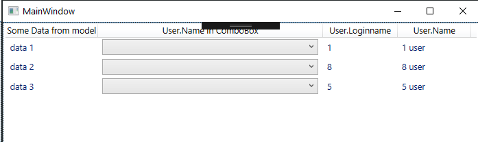
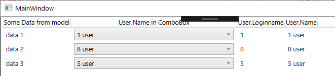

# Chombo Box binding in list view
### Problem
When open it need to be a values in comboBox

### solution
[Link to stackoverflow question](https://stackoverflow.com/questions/60561663/wpf-combobox-binding-in-list-view/60618472#60618472)

